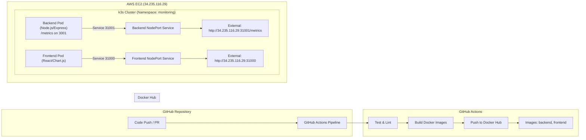
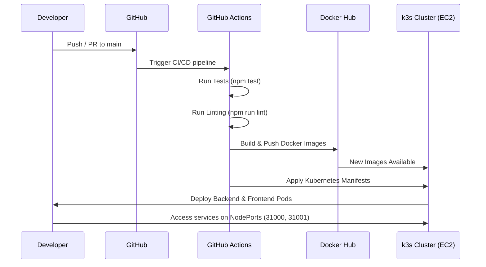

# 📊 Monitoring Dashboard Platform

A lightweight **monitoring dashboard** for visualizing real-time metrics.  
It includes a **Node.js backend** and **React frontend**, containerized with **Docker**, orchestrated via **k3s Kubernetes (AWS EC2)**, and automated using a **GitHub Actions CI/CD pipeline**.

---

## 🏗️ System Architecture



---

## ⚙️ Tech Stack & Reasoning

- **Node.js / Express** → Lightweight, efficient, and well-suited for microservices.  
- **React / Chart.js** → Modern component-based UI with real-time chart rendering.  
- **Docker** → Guarantees consistency across dev & prod, compact multi-stage builds.  
- **k3s (Kubernetes)** → Lightweight Kubernetes distribution for EC2 single-node clusters.  
- **GitHub Actions** → Fully automated CI/CD with GitHub integration and Docker/Kubernetes support.  

---

## 🛠️ Local Deployment Guide

### **Prerequisites**
- Docker  
- k3s & kubectl installed  
- GitHub & Docker Hub account (`suryatejainfra`)  
- Node.js (optional for local dev)  
- EC2 key pair for SSH  

### **Steps**
1. **Clone Repository**
   ```bash
   git clone https://github.com/bhanusaisuryatejadevops/Infilect-monitoring-dashboard.git
   cd Infilect-monitoring-dashboard
   ```

2. **Run Locally (Docker Compose)**
   ```bash
   docker-compose up --build
   ```
   - Backend → [http://localhost:3001/metrics](http://localhost:3001/metrics)  
   - Frontend → [http://localhost:3000](http://localhost:3000)

3. **Set Up k3s on EC2**
   ```bash
   ssh -i <path-to-ec2-key.pem> ubuntu@34.235.116.29
   curl -sfL https://get.k3s.io | sh -
   export KUBECONFIG=/etc/rancher/k3s/k3s.yaml
   sudo cp /etc/rancher/k3s/k3s.yaml ~/.kube/config
   sudo chown $(whoami):$(whoami) ~/.kube/config
   chmod 600 ~/.kube/config
   ```

4. **Apply Kubernetes Manifests**
   ```bash
   kubectl apply -f k8s/namespace.yaml
   kubectl apply -f k8s/backend-deployment.yaml
   kubectl apply -f k8s/backend-service.yaml
   kubectl apply -f k8s/frontend-deployment.yaml
   kubectl apply -f k8s/frontend-service.yaml
   ```

---

## 🔄 Running the CI/CD Pipeline



### **Secrets Required**
- `DOCKER_USERNAME` → Docker Hub username (`suryatejainfra`)  
- `DOCKER_PASSWORD` → Docker Hub access token  
- `K3S_TOKEN` → From EC2:  
  ```bash
  sudo cat /var/lib/rancher/k3s/server/node-token
  ```

### **Pipeline Stages**
1. **Test** → `npm test` (backend & frontend)  
2. **Lint** → `npm run lint`  
3. **Build & Push** → Docker images → Docker Hub  
4. **Deploy** → Applies Kubernetes manifests  

👉 **Pipeline Status:** [GitHub Actions](https://github.com/bhanusaisuryatejadevops/Infilect-monitoring-dashboard/actions)  

---

## 📡 Accessing Services

- **Local (Docker Compose):**
  - Backend → [http://localhost:3001/metrics](http://localhost:3001/metrics)  
  - Frontend → [http://localhost:3000](http://localhost:3000)  

- **Kubernetes (k3s on EC2):**
  - Backend → [http://34.235.116.29:31001/metrics](http://34.235.116.29:31001/metrics)  
  - Frontend → [http://34.235.116.29:31000](http://34.235.116.29:31000)  

---

## 📝 Viewing Logs & Troubleshooting

### **Logs**
- **Docker Compose**
  ```bash
  docker-compose logs backend
  docker-compose logs frontend
  ```
- **Kubernetes**
  ```bash
  kubectl -n monitoring logs -l app=backend
  kubectl -n monitoring logs -l app=frontend
  ```

### **Pod Status**
```bash
kubectl -n monitoring get pods
```

### **Check k3s Service**
```bash
sudo systemctl status k3s
sudo systemctl restart k3s   # if needed
```

### **Networking**
- Ensure EC2 security group allows:  
  - `6443` → k3s API  
  - `31000` → Frontend  
  - `31001` → Backend  

### **Verify Images**
- [Docker Hub Repository](https://hub.docker.com/u/suryatejainfra)  

---

✅ This `README.md` is fully self-contained — all diagrams are written in **Mermaid** and render directly on GitHub.  
